# Configuraciones y resultados de los experimentos (TP5)

Reporte autocontenido: **metodología**, **configuración de partida**, **cada experimento con su
configuración completa** y **los resultados** (con los mismos gráficos que la presentación).

- **Reproducibilidad:** todo corre con `seed=0`. 1a y 1b reproducen **al dígito**; el VAE no es
  bit-a-bit reproducible (el muestreo del reparam usa el RNG global de numpy), pero las
  conclusiones se mantienen.
- **Implementación:** numpy puro, desde cero. La red de 1a/1b es la del **TP3** (`mlp/`); el VAE es
  `tp5lib/vae_core.py` (backprop derivado a mano, verificado por gradient check).

Fuentes de configuración:
[`ej1a_secuencial/`](ej1a_secuencial/) ·
[`ej1b_denoising/run_experiments.py`](ej1b_denoising/run_experiments.py) ·
[`ej1b_denoising/exp_hidden_sweep.py`](ej1b_denoising/exp_hidden_sweep.py) ·
[`ej2_vae/run_experiments.py`](ej2_vae/run_experiments.py) ·
[`tp5lib/`](tp5lib/) · [`mlp/`](mlp/).

---

## Metodología: las fases de experimentación

La búsqueda de la receta de 1a y 1b **no es** un barrido exhaustivo de la grilla de
hiperparámetros. Es un **descenso por coordenadas** ("coordinate descent"): se parte de una
configuración inicial y, **cambiando un eje a la vez**, se adopta el ganador de cada paso antes de
pasar al siguiente. Cada experimento hereda la config acumulada hasta ese momento.

Eso permite **"ganarse el orden"**: mostrar un camino chronológico desde una config naive hasta la
ganadora, en vez de presentar ablaciones sueltas todas ancladas en el resultado final.

Hay dos tipos de decisión:

- **Adopciones directas** (de la teoría y del TP3): no se barren, se justifican.
  - `loss = BCE` (datos binarios → verosimilitud de Bernoulli; heredada del TP3).
  - `activación latente = identity` (clase 18.2: el cuello es un perceptrón lineal).
  - `activación de salida = sigmoid` (acota a `[0,1]`, acoplada a BCE).
  - `activación oculta = tanh` (no-linealidad que extiende PCA).
- **Ejes que se ganan con un experimento** (cada uno mueve una coordenada):
  - **1a:** optimizador → learning rate → tamaño de la capa oculta → tamaño del espacio latente.
  - **1b:** tamaño del espacio latente → tamaño de la capa oculta → ruido de entrenamiento.

**Regla de selección (Occam):** objetivo `px_max ≤ 1`; entre las configs que lo logran, la **más
parsimoniosa** (menos parámetros). Empates en píxeles → se mantiene el incumbente.

---

## Parte 1a — Autoencoder (32 letras → 2D)

**Objetivo:** aprender las 32 letras de `font.h` (7×5 = 35 px binarios) en un espacio latente de
**2 dimensiones**, con error máximo de **1 píxel**.

### Configuración de partida (naive)

| Ítem | Valor de partida | Por qué |
|---|---|---|
| Arquitectura | `35-20-2-20-35` | entrada/salida **35** por los datos; latente **2** por la consigna; oculta **20** provisional (se gana en el Paso 3) |
| Activaciones | `tanh` / `identity` (latente) / `tanh` / `sigmoid` (salida) | adopciones directas (ver metodología) |
| Init de pesos | `auto` por capa: **Xavier** para tanh/sigmoid, **He** para relu, **uniforme** `[−0.1, 0.1]` para identity | estándar por tipo de activación |
| Loss | `BCE` | adopción directa (binario / TP3) |
| **Optimizador** | **`SGD(lr=0.5)`** | **arranque naive** — es lo primero que se gana |
| Épocas · batch | 6000 · 32 (full-batch) | las 32 letras son el universo; memorizarlas **es** el objetivo |
| Selección de pesos | `fit()` restaura los pesos del mejor `val_loss` | — |
| Semilla | `seed=0` | reproducible |

> En 1a se usa `eps=1e-4` en Adam (en vez del default `1e-8`) para estabilizar las comparaciones.

### Exploración del dataset (E0)

32 caracteres ASCII de 7×5. Hay **pares casi idénticos** (`l` y `|` a 2 px) que igual hay que
separar en 2D: por eso comprimir a 2 dimensiones es difícil.

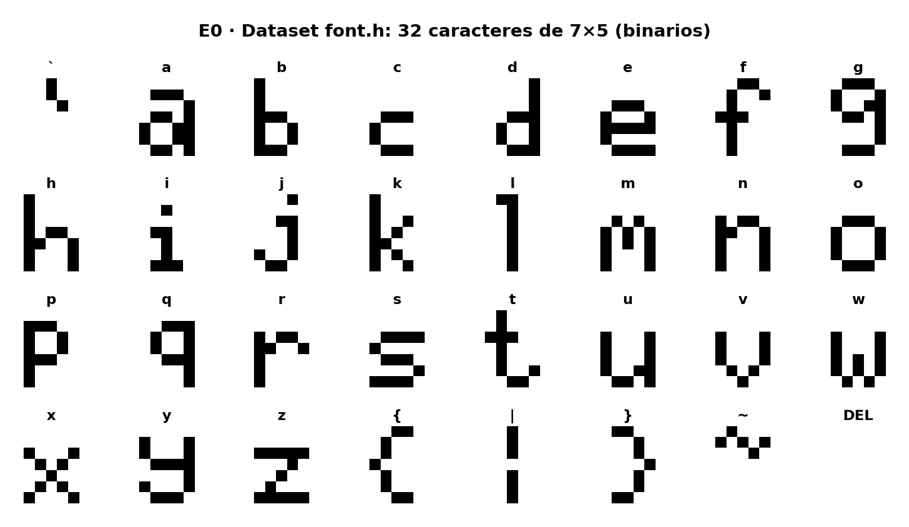
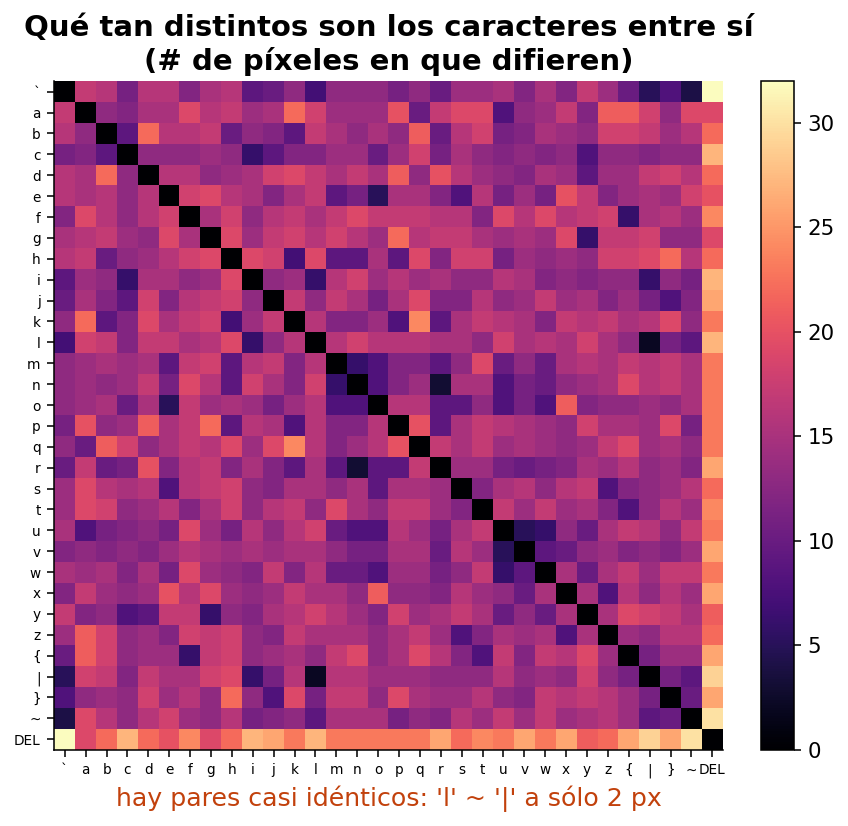

### Paso 1 — Optimizador

| | |
|---|---|
| **Variamos** | `SGD(0.5)` · `Momentum(0.1, β=0.9)` · `Adam(0.01, β1=.9, β2=.999, eps=1e-4)` |
| Config fija | `35-20-2-20-35` · tanh · BCE · latente 2 · 6000 ep · full-batch · seed 0 |

**Resultado.** SGD se estanca (5 px de error máximo), Momentum casi (1 px), **Adam llega a 0 px**
(32/32 letras perfectas). Adam ya supera la limitación del espacio latente de dimensión 2.
→ se adopta **Adam(0.01)**.

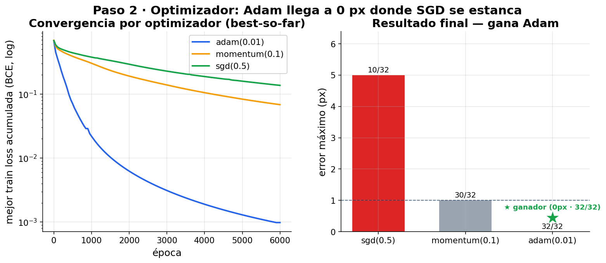
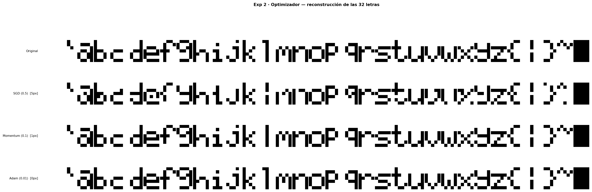

### Paso 2 — Learning rate (con Adam ya fijado)

| | |
|---|---|
| **Variamos** | `lr ∈ {0.0003, 0.01, 0.3}` con Adam |
| Config fija | `35-20-2-20-35` · tanh · BCE · Adam · latente 2 · 6000 ep |

**Resultado.** El chico (0.0003) tarda (recupera 10/32, con más épocas llegaría); el grande (0.3)
**no aprende** (28 px); **0.01 llega a 0 px**. → se adopta **lr = 0.01**.

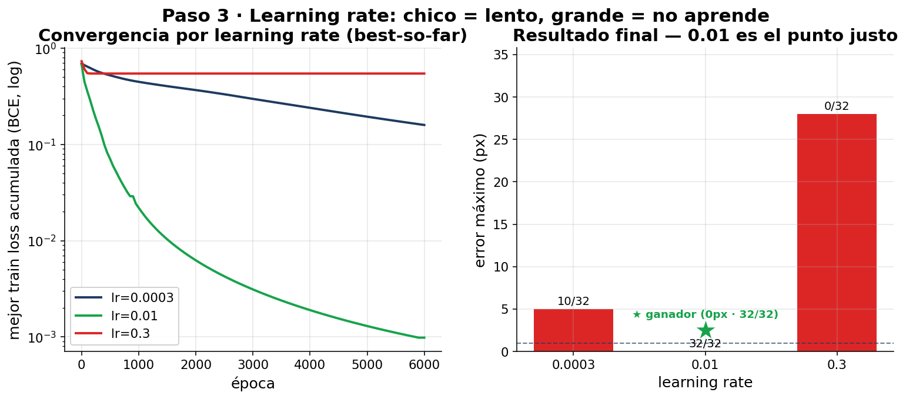

### Paso 3 — Tamaño de la capa oculta

| | |
|---|---|
| **Variamos** | `hidden ∈ {(), 10, 20, 30, 20+20}` por lado |
| Config fija | tanh · BCE · Adam(0.01) · latente 2 · 6000 ep |
| Nota | `()` = encoder lineal (≈ PCA); `20+20` = dos capas apiladas |

**Resultado.** Sin capa oculta = PCA (falla); 10 no alcanza; **20 → 0 px**. 30 y 20+20 empatan en
0 px pero con más parámetros → por **parsimonia, 20** (1557 pesos).

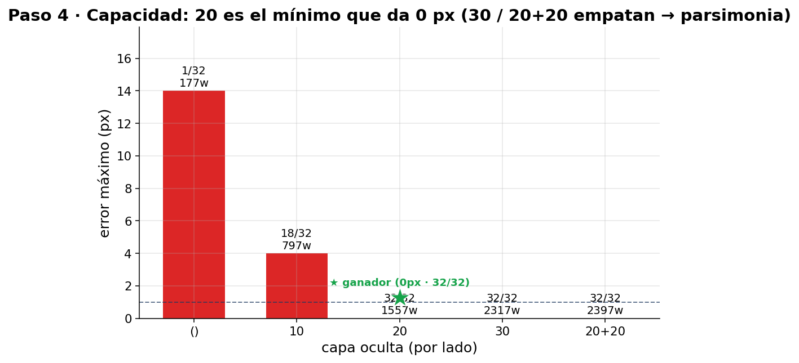

### Paso 4 — Tamaño del espacio latente

| | |
|---|---|
| **Variamos** | `latente ∈ {1, 2, 3}` |
| Config fija | `35-20-·-20-35` · tanh · BCE · Adam(0.01) |

**Resultado.** Con **1D** solo se aprende un **subconjunto (14/32)**: no se pueden separar 32 letras
en una recta. **2D → 0 px** (3D no mejora). Confirma el latente=2 de la consigna.

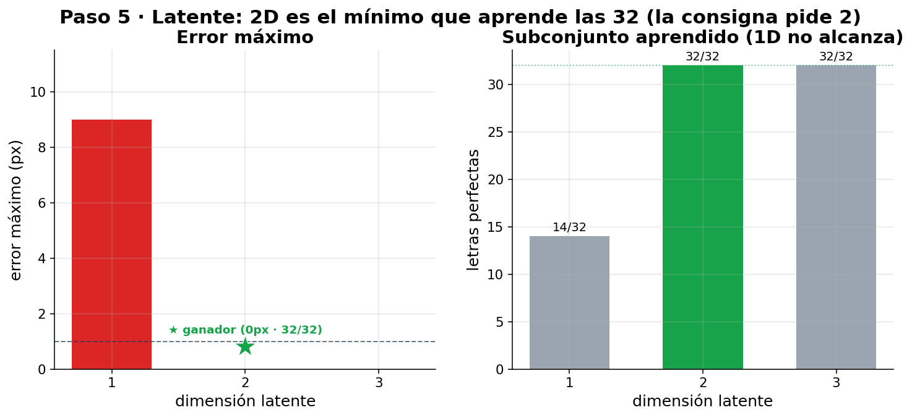

### Config ganadora de 1a

`35-20-2-20-35` · tanh / identity / tanh / sigmoid · **BCE** · **Adam(0.01)** · 6000 ep · full-batch.
Recupera las **32/32 letras con 0 px de error**.

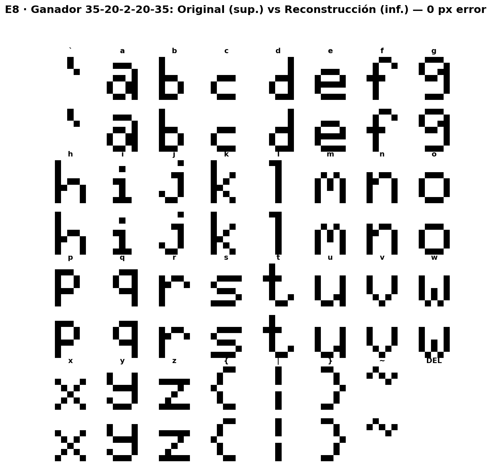
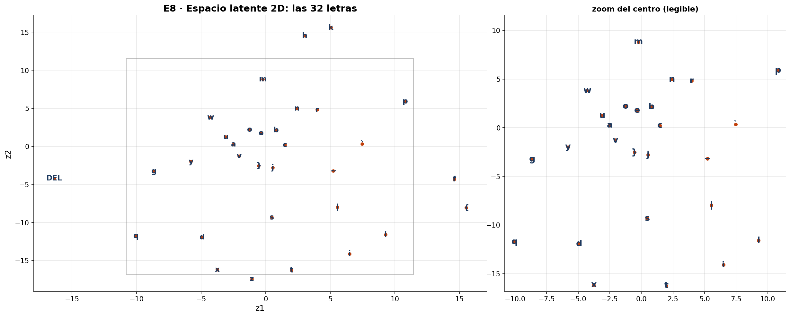
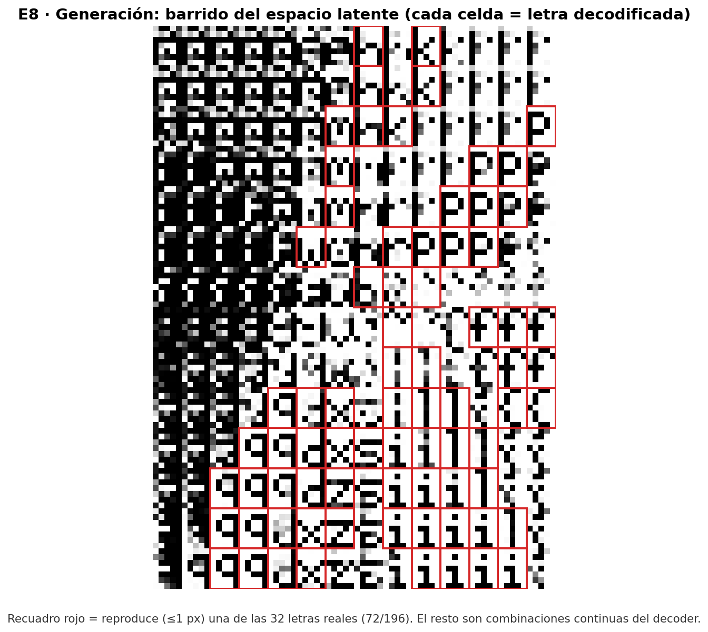
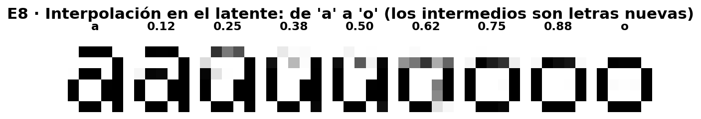

- **Generación:** grilla **14×14** de puntos del latente, cada uno decodificado.
- **Interpolación:** 9 pasos lineales `(1−t)·z_a + t·z_o`, de `a` a `o` (los intermedios son letras
  nuevas — el *concept vector*).

---

## Parte 1b — Denoising Autoencoder

**Objetivo:** plantear una arquitectura para **limpiar ruido** y estudiar cuánto ruido tolera.

### Configuración base (común a E9–ganador)

| Ítem | Valor |
|---|---|
| Dataset | mismas 32 letras de `font.h` (35 px binarios) |
| Arquitectura | `35-{oculta}-{latente}-{oculta}-35`; **ganadora: `35-30-10-30-35`** |
| Activaciones | tanh / identity (latente) / tanh / sigmoid |
| Loss · Opt | `BCE` · `Adam(0.01, eps=1e-8)` (eps default, a diferencia de 1a) |
| Entrenamiento | `train_denoising`: full-batch, **bit-flip fresco cada época** (cada píxel se invierte con prob. `p`), **target = patrón limpio**. No usa `fit()`, sin best-weights |
| Evaluación | `eval_denoise`: por nivel de test, px-error medio sobre `trials` realizaciones × 32 letras (RNG `seed=123`); reporta px medio, frac ≤1px y frac perfectas |

### El ruido: bit-flip

Cada píxel se invierte (0↔1) con probabilidad `p`, **fresco en cada época** (la red nunca ve dos
veces la misma "mancha").

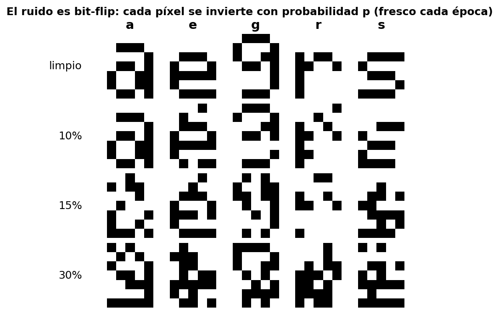

### Motivación — el AE de 1a no limpia

Si le damos entradas ruidosas al autoencoder de 1a (que **no** fue entrenado para limpiar), la
salida se deforma y el error crece con el ruido: hace falta entrenar específicamente para limpiar.

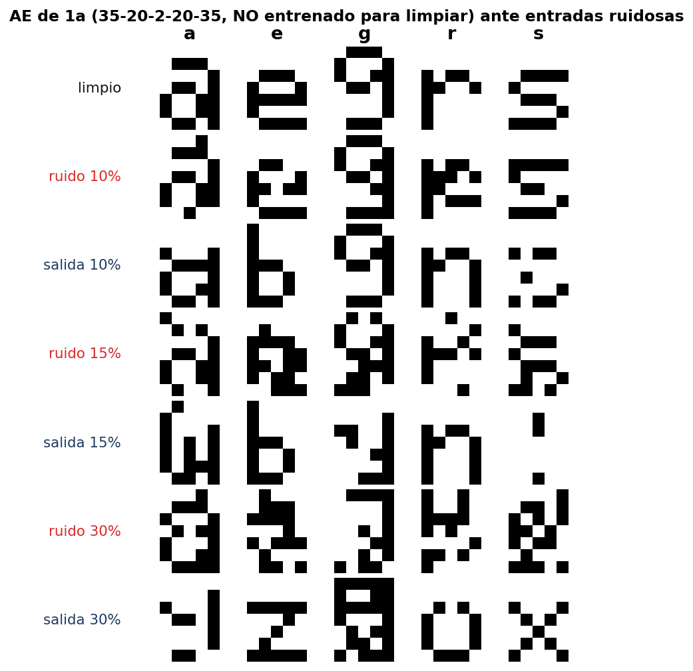
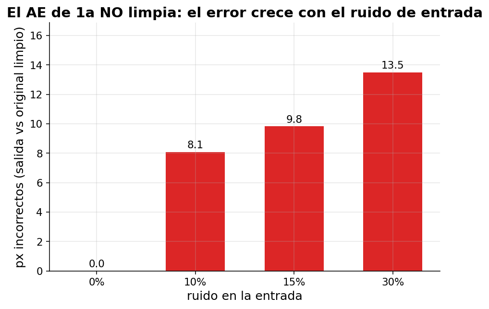

### Cómo se entrena un denoiser

Es la **misma red y la misma loss (BCE)** que el autoencoder. Lo único que cambia es el par
(entrada, objetivo): en vez de `x → x`, ahora **`sucio → limpio`**. Las entradas se ensucian con
bit-flip fresco cada época y se exige que la salida sea la letra original limpia.

### E9 — Tamaño del espacio latente (base 35-20)

| | |
|---|---|
| **Variamos** | `latente ∈ {2, 5, 10, 20}` |
| Hereda | base de **1a** (`35-20-·-20-35`) — barremos el latente antes de tocar el ancho oculto |
| Ruido de entrenamiento | `p_train = 0.15`; 6000 ep |
| Evaluación | 30 realizaciones × 32 letras, test `p ∈ {0.1, 0.2, 0.3}` |

**Resultado** (% letras ≤1px a 20% de ruido): **2 → 44.5%** · 5 → 47.9% · **10 → 53.6%** · 20 → 53.4%
(satura). El latente 2D de 1a limpia mal; agrandarlo a 10 ayuda; más de 10 no aporta. → **latente = 10**.

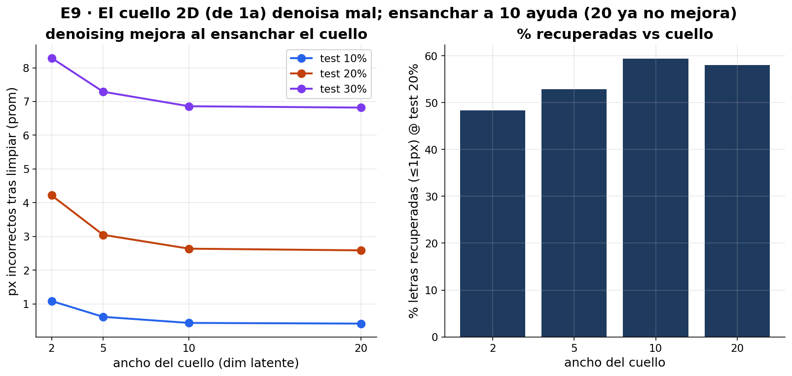

### E9b — Tamaño de la capa oculta (latente fijo en 10)

| | |
|---|---|
| **Variamos** | `capa oculta ∈ {20, 30, 35, 40}` |
| Hereda | latente fijo en **10** (ganador de E9); resto igual (BCE, Adam(0.01), p_train=0.15, 6000 ep) |
| Script | [`exp_hidden_sweep.py`](ej1b_denoising/exp_hidden_sweep.py) |

**Resultado** (% letras ≤1px a 20% de ruido · nº params): 20 → 53.6% (1885w) · **30 → 62.9% (2805w)**
· 35 → 61.8% (3265w) · 40 → 64.6% (3725w). El salto real es **20→30**; de ahí en más es una meseta.
Por **parsimonia**, **30** (empata prácticamente a 40 con 920 params menos). Así se gana el ancho
que antes estaba fijado en 25 sin barrido.

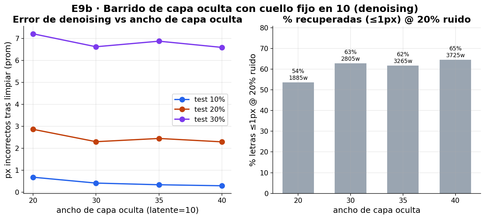

### E10 — Ruido de entrenamiento × nivel de test

| | |
|---|---|
| **Variamos** | `p_train ∈ {0.05, 0.15, 0.30}` |
| Config | `35-30-10-30-35`, 6000 ep |
| Evaluación | 30 realizaciones × 32 letras, test `p ∈ {0, 0.05, 0.10, 0.15, 0.20, 0.30, 0.40}` |

**Resultado.** Las curvas **se cruzan**: entrenar con poco ruido (5%) es mejor en limpio pero frágil;
con mucho (30%) es robusto a ruido alto pero peor en limpio. **15% es el mejor compromiso**.

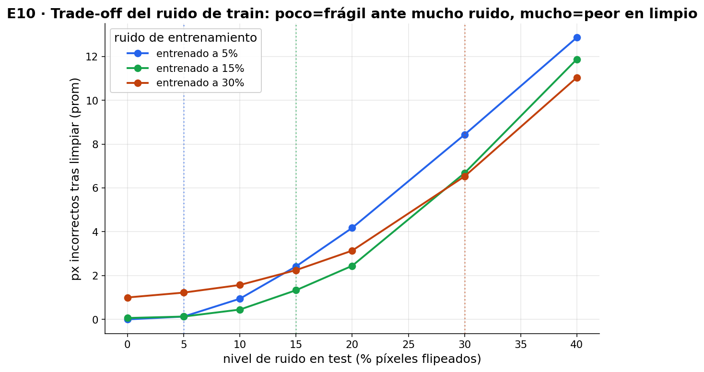

### Cualitativo — ¿qué pasa a 30% de ruido?

Si solo miramos píxeles coincidentes, el denoiser entrenado a 30% "parece" andar bien; pero
**visualmente** muchas letras no se reconstruyen. Es el régimen difícil (el bit-flip destruye
demasiada estructura del glifo).

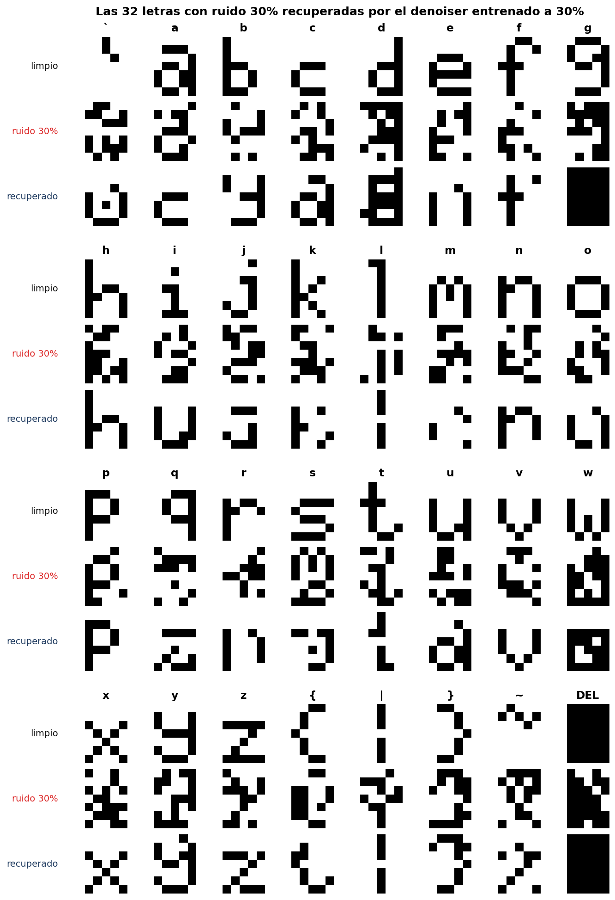

### Ganador 1b — número final

| | |
|---|---|
| Arquitectura | `35-30-10-30-35`, tanh/id/tanh/sigmoid, BCE, Adam(0.01) |
| Config | latente = 10, capa oculta = 30, `p_train = 0.15` |
| Épocas | **15000** (vs 6000 de los barridos), seed 0 |
| Evaluación | 50 realizaciones × 32 letras |

**Resultado:** **≤1 px en el 80% de las letras a 15% de ruido** (92% a 10%, 64% a 20%).

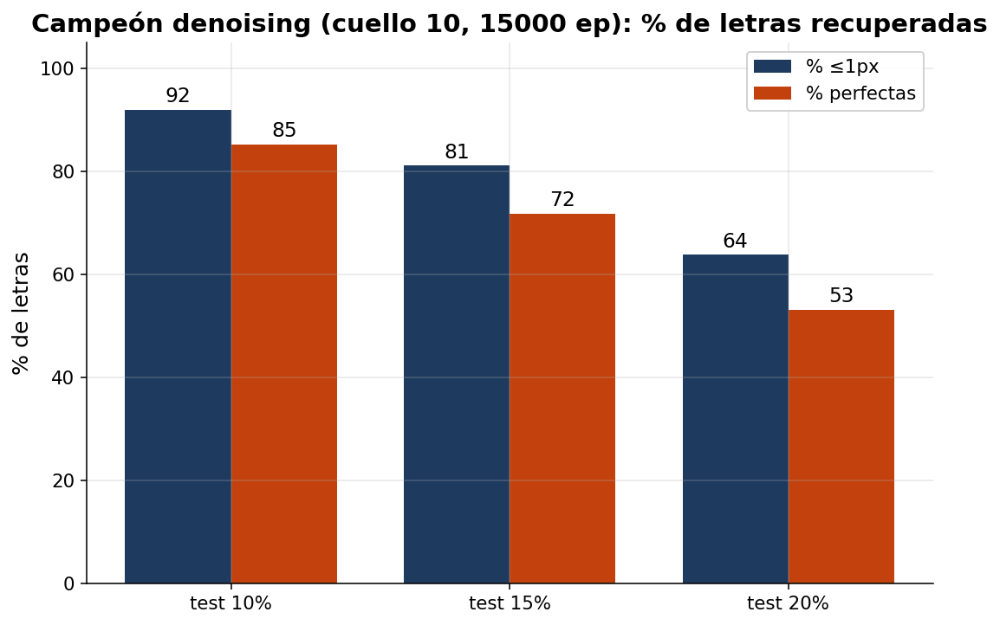
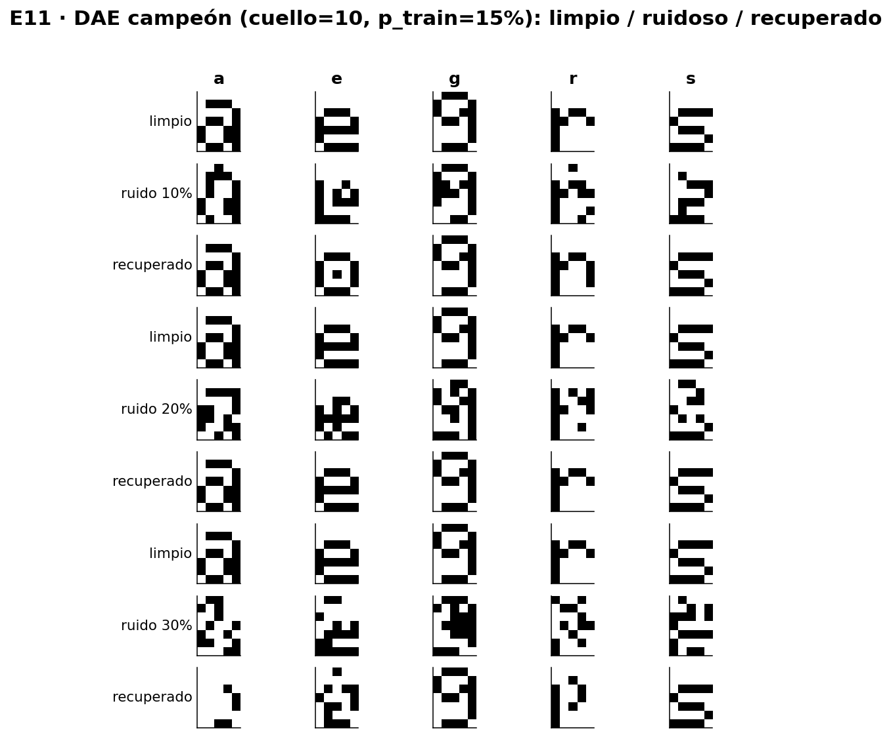

---

## Parte 2 — VAE (5 emojis)

**Objetivo:** un modelo **generativo** que pueda inventar imágenes nuevas muestreando del latente.

### Configuración base (común a E12–E18)

| Ítem | Valor |
|---|---|
| Dataset | OpenMoji `color` (canal **alpha** = silueta), 5 clases, 20×20 px, 140 variantes/clase = **700** imágenes |
| Augment (seedeado) | rotación ±15°, traslación ±2 px, ruido gaussiano `σ=0.03`, recorte `[0,1]` |
| Arquitectura | `400 → 128 → (μ, logσ²) en Z=2 → 128 → 400` |
| Encoder / Decoder | `tanh` + cabezas lineales `μ`, `logσ²` / `tanh` → logits → `sigmoid` |
| Reparam | `z = μ + σ·ε`, `ε ~ N(0,I)`, `σ = exp(½·logσ²)` |
| Init | **He**; bias 0; **`W_lv = 0`** (⇒ `σ=1` al inicio) |
| Loss | `recon(BCE-con-logits) + β·KL`, `KL = −0.5·Σ(1 + logσ² − μ² − σ²)/B` |
| Optimizador | `Adam(lr=1e-3, eps=1e-8)`; **3500** épocas, batch 128, shuffle por época |

> El backprop (KL + reparam trick) está derivado a mano en numpy y verificado con gradient check
> (error 5e-08). Las 5 clases: corazón, estrella, gota, luna, rayo (line-art descartado: a 20×20 los
> contornos se confunden).

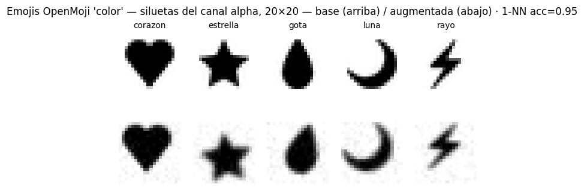

### E12 — Barrido de β (el experimento central)

| | |
|---|---|
| **Variamos** | `β ∈ {0, 0.5, 1, 4}` (4 VAEs) |
| Sampleo | 10 muestras de `N(0,I)`; semilla elegida para máxima diversidad de clases |

El **β** controla el forcejeo reconstrucción ↔ KL: β chico → latente desordenado (≈AE), β grande →
latente gaussiano ordenado pero reconstrucción más pobre.

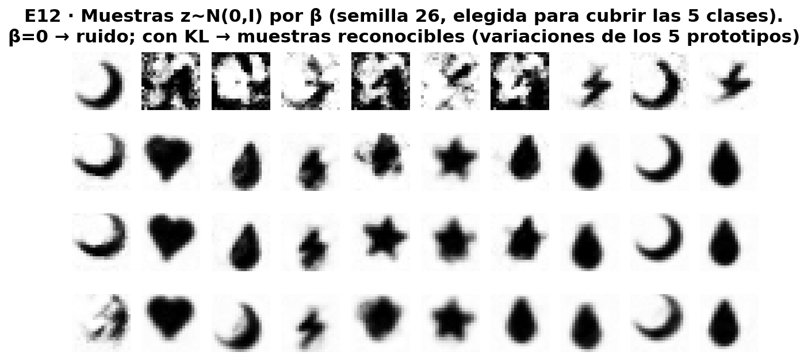

### E13 — Mapa latente por clase (β=1)

`μ = encode_mean(X)` de cada emoji, coloreado por clase, con los círculos del prior N(0,I).

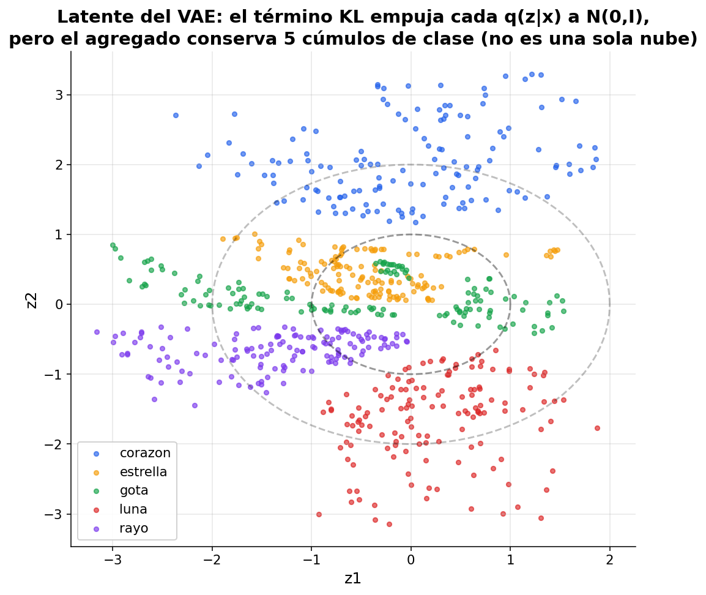

### E14 — Reconstrucción + generación (β=1)

Reconstrucción usando `μ` (sin ruido) y 10 muestras nuevas desde `N(0,I)`.

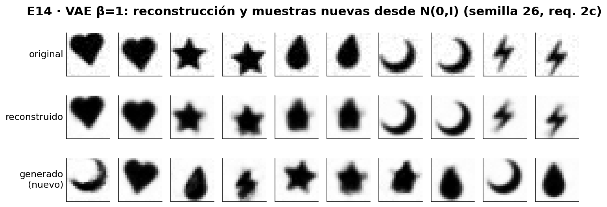

### E15 — Curvas recon vs KL

| | |
|---|---|
| **Variamos** | `β ∈ {0, 1, 4}` |
| Registra | términos `recon` y `KL` por época (log cada 5, `eps=0`) |

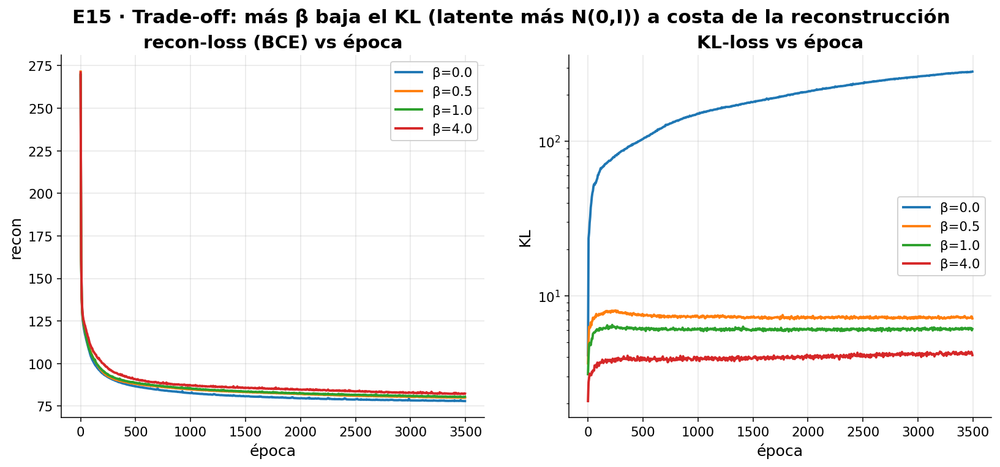

### E16 — AE (β=0) vs VAE (β=1)

Dispersión del mapa (±49 vs ±3.3), parecido a N(0,I) (std 1.17) y capacidad de samplear.

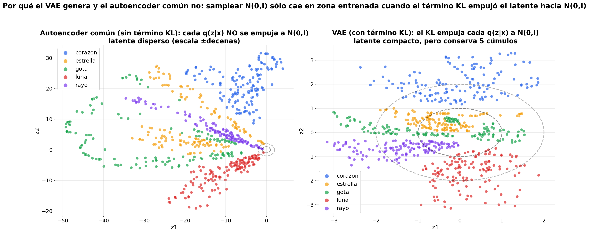

### E17 — Atlas del latente (β=1)

Grilla **13×13** en `[−2.5, 2.5]²`, cada punto decodificado → atlas continuo.

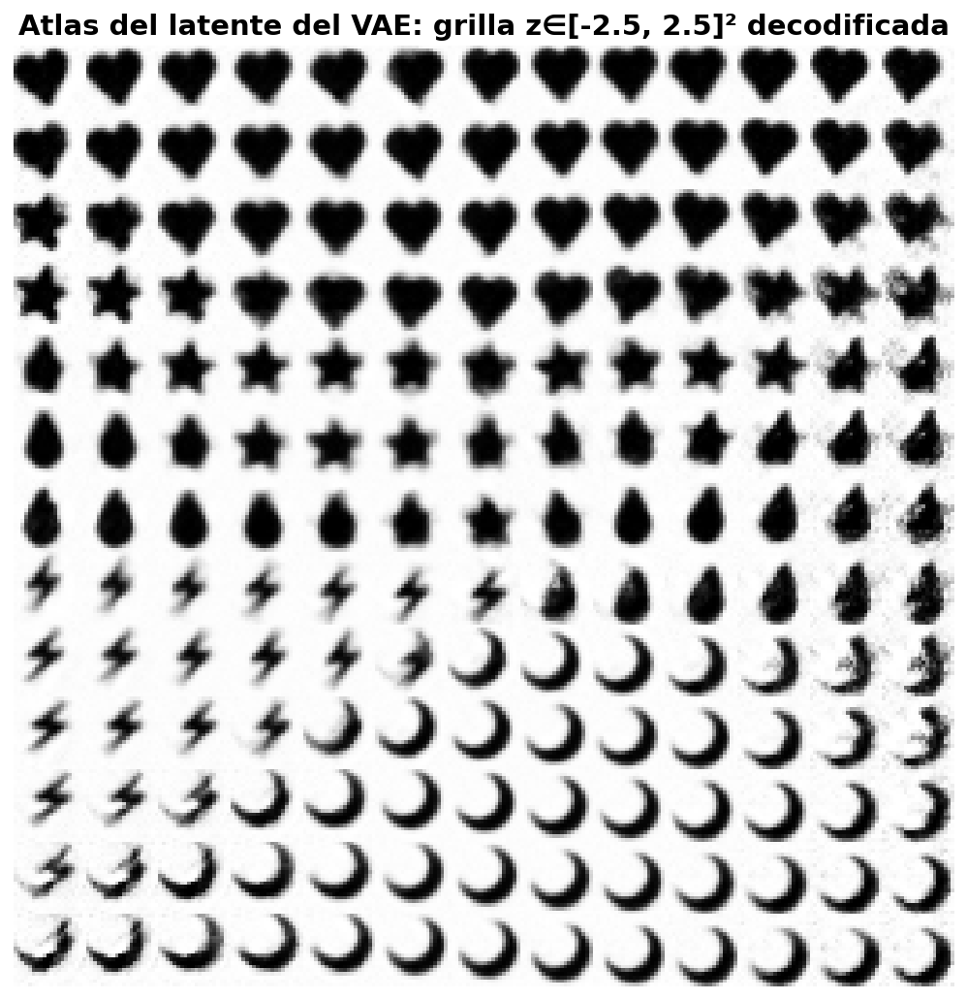

### E18 — Sampleo honesto

Sobre 200 semillas × 10 muestras: cobertura media **85%** (4.3/5 clases). Muestreo `z ~ N(0,I)` sin
cherry-picking → muestras válidas (lo que el AE simple no podía).

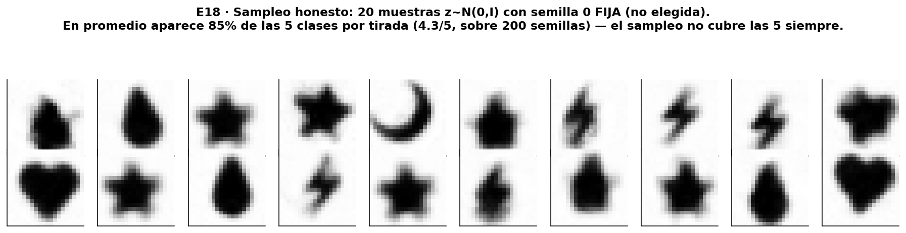
